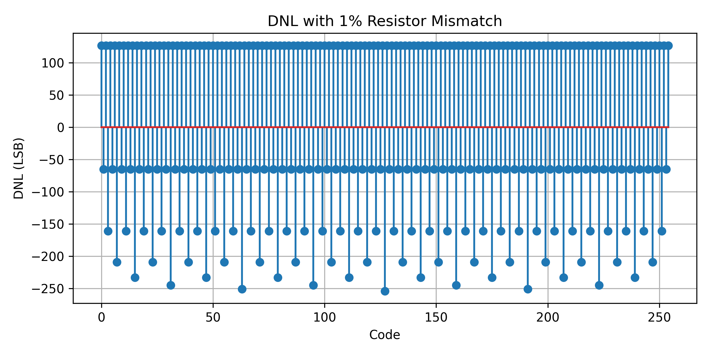
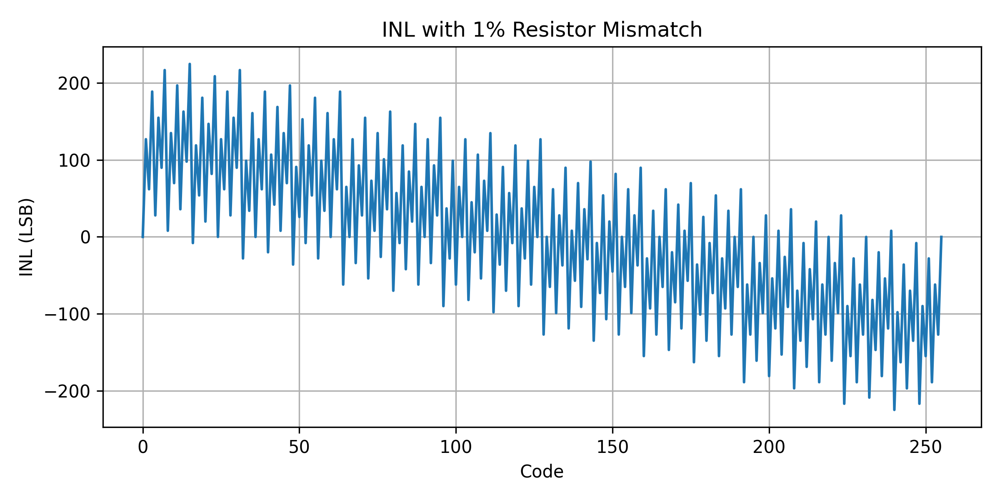
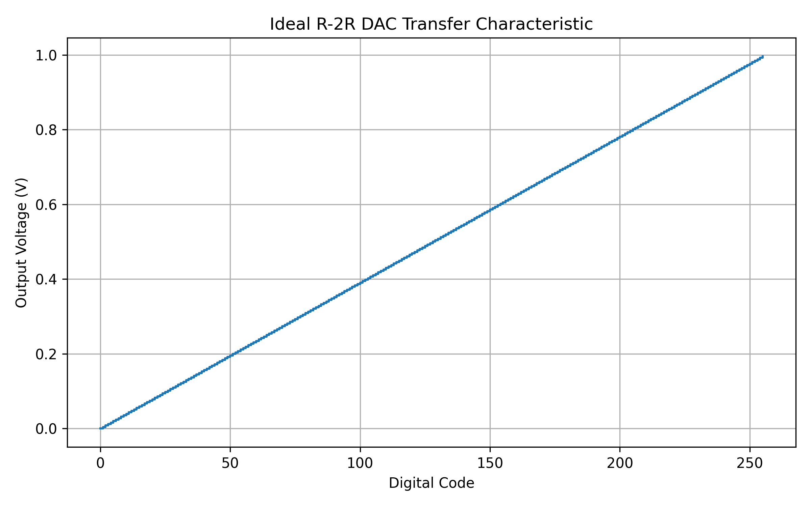

# R-2R Ladder Digital-to-Analog Converter

## Overview
This project implements and analyzes an R-2R ladder digital-to-analog converter (DAC) designed for audio-band signal conversion. The focus is on linearity, quantization behavior, and the impact of resistor mismatch—key considerations in mixed-signal and IC-adjacent design.

The DAC was evaluated through ideal modeling, Monte Carlo mismatch analysis, and standard nonlinearity metrics (DNL and INL).

---

## Monte Carlo Mismatch Analysis (Background & Methodology)

Monte Carlo analysis is a statistical technique historically adopted in analog and mixed-signal integrated circuit design to model the impact of random process variations on circuit performance. In the context of DACs, it is commonly used to evaluate the effects of resistor mismatch caused by lithographic variation, dopant fluctuations, and layout-dependent parasitics during semiconductor fabrication.

Rather than assuming ideal component values, Monte Carlo simulation repeatedly perturbs circuit parameters according to a defined probability distribution and evaluates the resulting system behavior. This approach became standard practice in IC design flows as process scaling increased variability and deterministic corner analysis became insufficient to capture yield-limiting effects.

In this project, resistor mismatch is modeled as a normally distributed random variable applied to each binary-weighted DAC element:

\[
R_i = R_{i,\text{ideal}} \cdot (1 + \epsilon_i), \quad \epsilon_i \sim \mathcal{N}(0, \sigma^2)
\]

where \( \sigma \) represents the relative standard deviation of resistor mismatch (set to 1% in this analysis). For each Monte Carlo run, a unique set of perturbed weights is generated, and the DAC output voltage is computed across all digital input codes. The results are then averaged across multiple runs to obtain statistically representative behavior.

This statistical modeling enables direct evaluation of standard DAC linearity metrics:
- **Differential Nonlinearity (DNL)**, which measures deviation of each step size from the ideal 1 LSB increment
- **Integral Nonlinearity (INL)**, which quantifies cumulative deviation from the ideal transfer characteristic

The resulting DNL and INL plots illustrate how small, random component mismatches propagate into measurable nonlinearity—an effect that directly impacts monotonicity, resolution, and achievable dynamic range in real DAC implementations.

  

  

---
## Architecture
- Binary-weighted R-2R ladder topology
- Passive resistor network driven by digital input codes
- Emphasis on monotonicity and output accuracy

The R-2R structure was chosen due to its widespread use in integrated DACs and its sensitivity to resistor matching errors.

---

## Ideal Transfer Characteristic
An ideal DAC model was simulated to establish a baseline transfer function between digital input code and analog output voltage.

**Key observations:**
- Linear and monotonic transfer behavior
- Uniform LSB step size
- No missing codes or nonlinearity

  

---

## Monte Carlo Resistor Mismatch Analysis
To model real-world manufacturing variation, resistor mismatch was introduced using a Monte Carlo approach with normally distributed errors (σ = 1%).

For each Monte Carlo run:
- Binary weights were randomly perturbed
- Output voltage was computed for all digital codes
- Results were averaged across runs

This analysis highlights how small component mismatches translate into measurable nonlinearity.

---

## Differential Nonlinearity (DNL)
DNL measures the deviation of each step size from the ideal 1 LSB value.

  

**Insights:**
- Step size variation caused by resistor mismatch
- Identification of potential missing-code risk regions
- Sensitivity of DAC resolution to component accuracy

---

## Integral Nonlinearity (INL)
INL represents the accumulated deviation from the ideal transfer curve.

  

**Insights:**
- Global distortion of the transfer characteristic
- Error accumulation across codes
- Importance of matching in precision DAC design

---

## Key Learnings
- Quantization effects and resolution limits in DACs
- Impact of resistor mismatch on linearity and accuracy
- Practical interpretation of DNL and INL metrics
- Mixed-signal fundamentals relevant to silicon and IC design

---

## Tools & Methods
- Python (NumPy, Matplotlib)
- Monte Carlo statistical modeling
- Virtual environment for reproducibility
- Version-controlled simulation artifacts

---

## Repository Structure